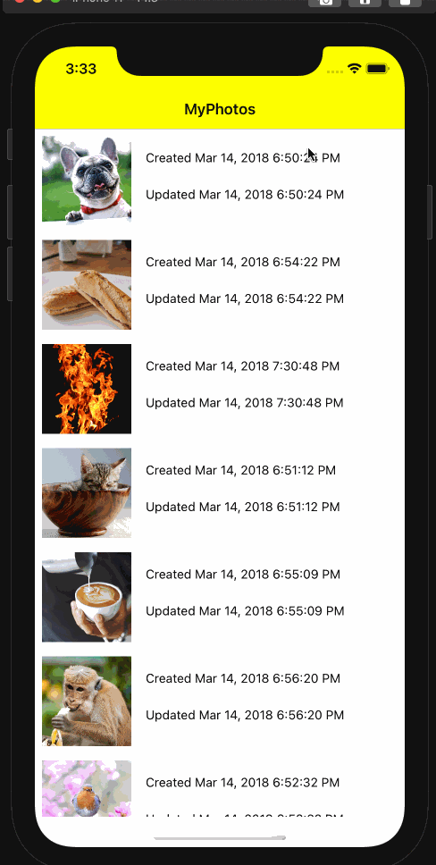

# MyPhotos

This is my submission for the Eulerity 48-hour take-home coding challenge. The objective of this app is 1) to display a list of images, 2) to allow editing of those images, and 3) to save these edited images.

## App Walkthrough GIF

Note: the yellow tint on the UI elements is a simulator bug!
Here is a GIF demo of the app:

## License 

    Copyright 2021 Soumik Barua

    Licensed under the Apache License, Version 2.0 (the "License");
    you may not use this file except in compliance with the License.
    You may obtain a copy of the License at

        http://www.apache.org/licenses/LICENSE-2.0

    Unless required by applicable law or agreed to in writing, software
    distributed under the License is distributed on an "AS IS" BASIS,
    WITHOUT WARRANTIES OR CONDITIONS OF ANY KIND, either express or implied.
    See the License for the specific language governing permissions and
    limitations under the License.
